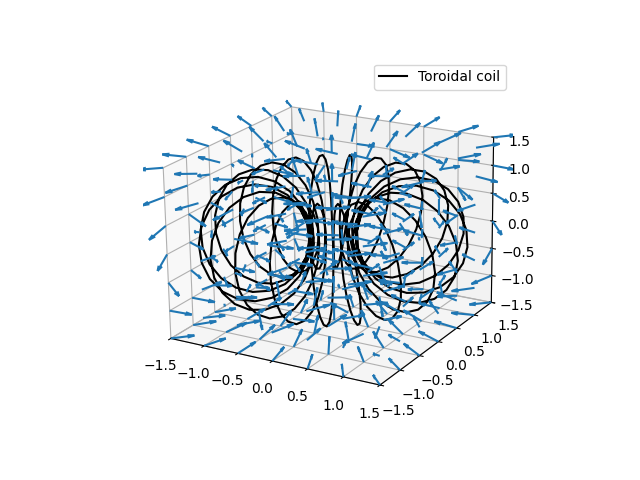
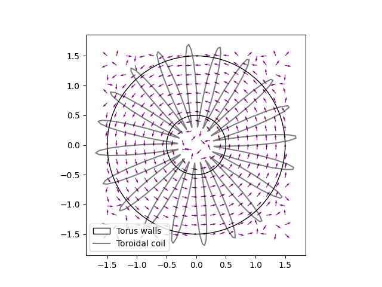
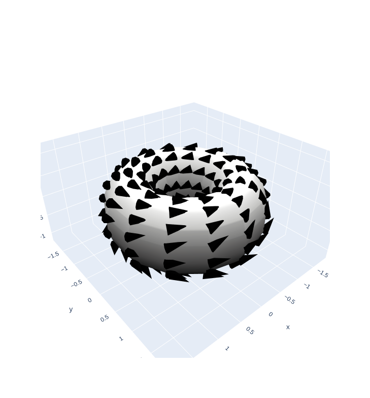
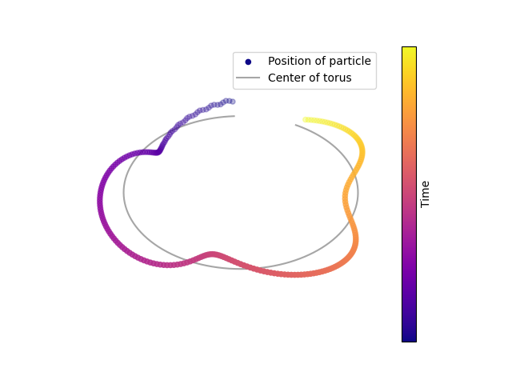
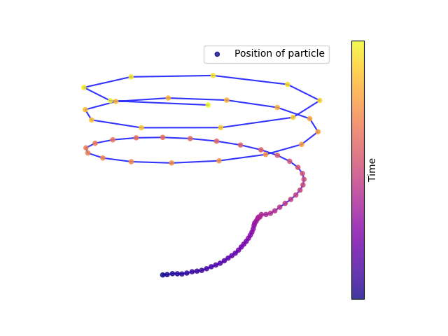
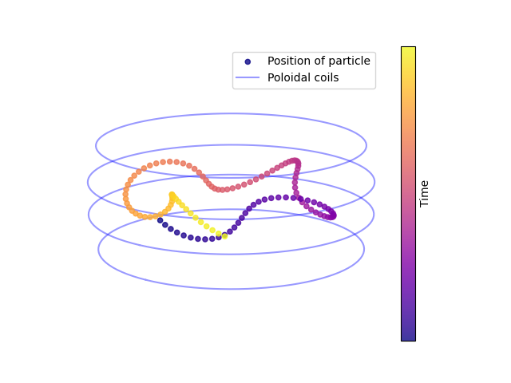
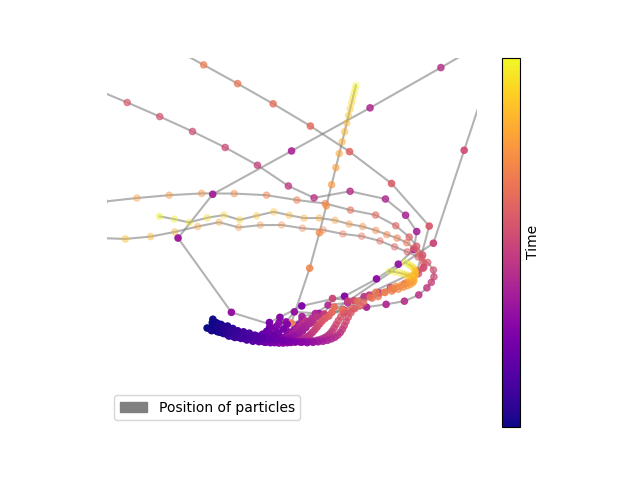
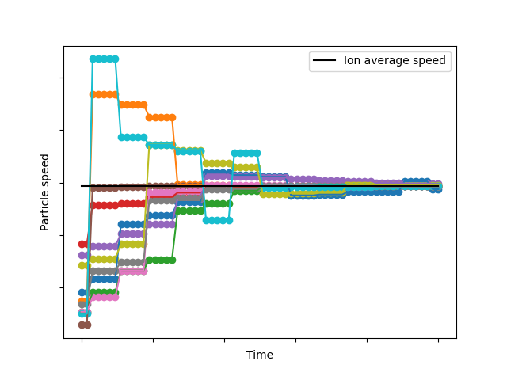

# Particle simulation in a tokamak reactor

## Files

### functions
Functions that are used for some of the files

### field_visualizer
Calculate and visualize the fields that are generated by the coils in a tokamak reactor. 

### particle_simulation
Calculate and visualize the trajectory of a single particle in the helical field generated by the tokamak reactor, as well as some of the possible particle drifts.

### collisions
Simulate the collisions between multiple particles, calculate and visualize how their trajectories and velocities change with time.

## Example Results

### Magnetic field generated by the toroidal field coils

### Total helical magnetic field of a tokamak reactor

### Simulate the trajectory of a particle in the helical field

### Simulate the curved field drift on a particle, and the corresponding fix using the poloidal field coils

### Simulate the deviations of particles due to collisions inside of the plasma

### Calculate the thermalization of particles due to collisions

